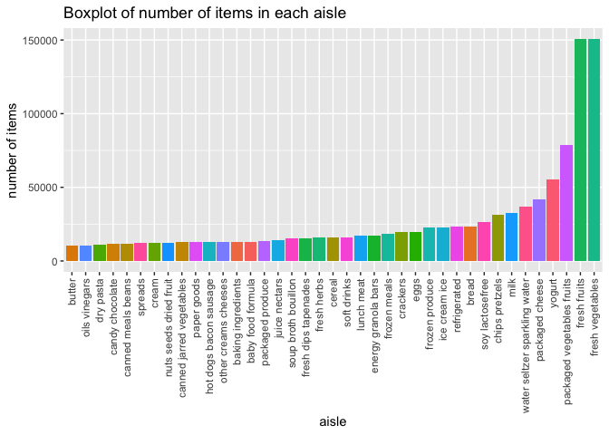
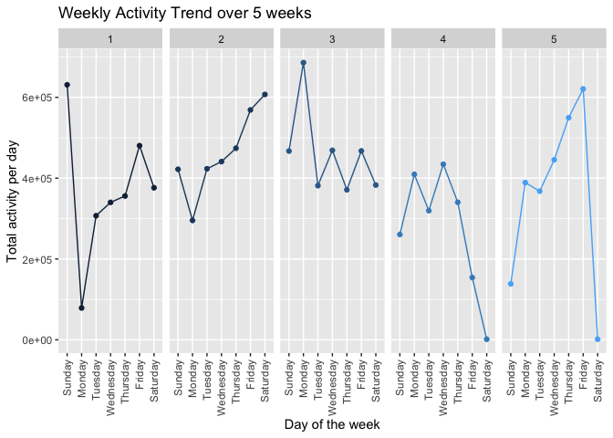
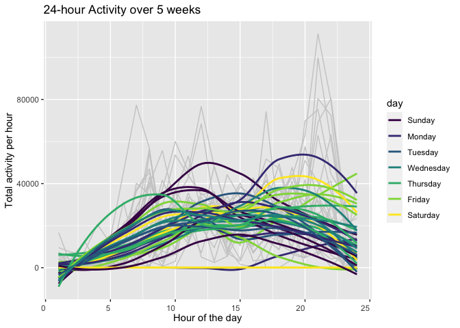
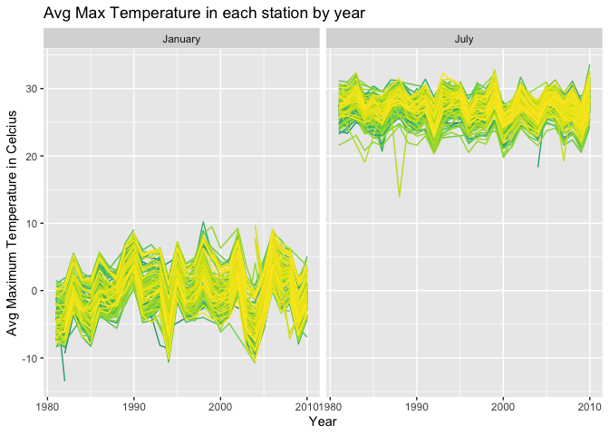
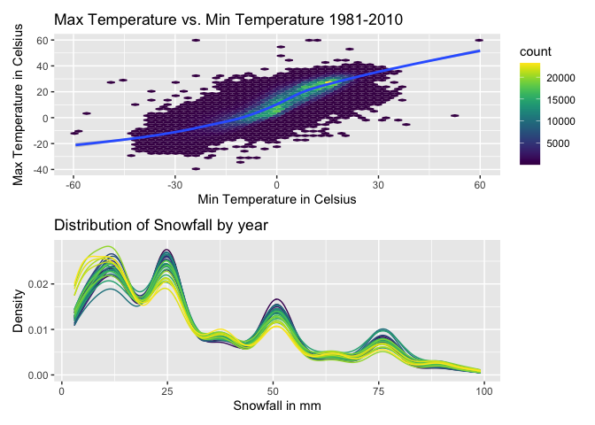

p8105_hw3_yh3554
================

# Problem 1

Load the data from `p8105.datasets`.

``` r
data("instacart")
```

#### Exploring the dataset

``` r
head(instacart %>% 
  group_by(department, aisle, product_name) %>%
  summarize(n = n()) %>%
  mutate(rank = min_rank(desc(n))) %>%
  filter(rank < 4) %>%
  arrange(desc(n)))
```

    ## `summarise()` has grouped output by 'department', 'aisle'. You can override
    ## using the `.groups` argument.

    ## # A tibble: 6 × 5
    ## # Groups:   department, aisle [2]
    ##   department aisle                      product_name               n  rank
    ##   <chr>      <chr>                      <chr>                  <int> <int>
    ## 1 produce    fresh fruits               Banana                 18726     1
    ## 2 produce    fresh fruits               Bag of Organic Bananas 15480     2
    ## 3 produce    fresh fruits               Organic Strawberries   10894     3
    ## 4 produce    packaged vegetables fruits Organic Baby Spinach    9784     1
    ## 5 produce    packaged vegetables fruits Organic Raspberries     5546     2
    ## 6 produce    packaged vegetables fruits Organic Blueberries     4966     3

#### Summary of instacart dataset

The instacart dataset is online grocery data from the Instacart in 2017.
It has 1384617 observations and 15 variables. Each observation from the
dataset is a product from an order. The dataset includes identifier,
product information, order number, order from cart or not, reorder from
past or not, customer identifier, time variables the ordered was placed,
aisle information, and department information.  
The key variables are user identifier, product identifier, product name,
aside, department name, day which ordered in a week, hour which ordered
in a day, day since prior order, and order numbers. There are 131209
customers using the app. The mean hour which ordered in a day is 14, the
earliest hour is 0, the lastest hour is 23. The most popular products
are banana, bag of organic bananas, organic, strawberries, raby spinach,
raspberries, and bluebeeries which are all from produce department.  
For example, Row 1 indicates one customer purchased Bulgarian Yogurt at
10 o’clock on Thursday. This customer had made 3 purchases before this
order. This customer picked the product from yogurt aisle in the dairy
eggs department.

#### Total number of aisles and most popular aisles.

Apply `distinct()` to find the numbers of aisles, and use `count()` to
find the most popular aisles.

``` r
p1_df1 <- instacart %>% 
  select(aisle, department, aisle_id) %>%
  arrange(aisle) %>%
  distinct(aisle, .keep_all = TRUE)

p1_df2 <- instacart %>%
  count(aisle, name = "n_obs") %>%
  arrange(desc(n_obs))
head(p1_df2)
```

    ## # A tibble: 6 × 2
    ##   aisle                          n_obs
    ##   <chr>                          <int>
    ## 1 fresh vegetables              150609
    ## 2 fresh fruits                  150473
    ## 3 packaged vegetables fruits     78493
    ## 4 yogurt                         55240
    ## 5 packaged cheese                41699
    ## 6 water seltzer sparkling water  36617

There are 134 aisles, and the aisles have the most ordered item are
fresh vegetables, fresh fruits, and packaged vegetables fruits which
corresponding to 150609, 150473, and 78493 items.

#### Plot of number of items ordered for each aisles with more than 10,000 items

``` r
p1_df3 <- instacart %>%
  count(aisle, name = "n_items") %>%
  arrange(desc(n_items)) %>%
  filter(n_items >= 10000)

numbers_items_barplot <- p1_df3 %>%
  ggplot(aes(reorder(aisle, n_items), n_items, fill = aisle)) + 
  geom_bar(stat = "identity") + 
  labs(
    x = "aisle",
    y = "number of items",
    title = "Boxplot of number of items in each aisle"
    ) +
  theme(axis.text.x = element_text(angle = 90, vjust = 0.5, hjust = 1), 
        legend.position = "none")

numbers_items_barplot
```

<!-- -->

#### Table of three most popular items in “baking ingredients”, “dog food care”, and “packaged vegatables fruits”.

``` r
instacart %>% 
  filter(aisle %in% c("baking ingredients", "dog food care", "packaged vegetables fruits")) %>%
  group_by(aisle, product_name) %>%
  summarize(n = n()) %>%
  mutate(rank = min_rank(desc(n))) %>%
  filter(rank < 4) %>%
  arrange(aisle, rank) %>%
  knitr::kable(digit = 0, caption = "most popular items in each aisles")
```

    ## `summarise()` has grouped output by 'aisle'. You can override using the
    ## `.groups` argument.

| aisle                      | product_name                                  |    n | rank |
|:---------------------------|:----------------------------------------------|-----:|-----:|
| baking ingredients         | Light Brown Sugar                             |  499 |    1 |
| baking ingredients         | Pure Baking Soda                              |  387 |    2 |
| baking ingredients         | Cane Sugar                                    |  336 |    3 |
| dog food care              | Snack Sticks Chicken & Rice Recipe Dog Treats |   30 |    1 |
| dog food care              | Organix Chicken & Brown Rice Recipe           |   28 |    2 |
| dog food care              | Small Dog Biscuits                            |   26 |    3 |
| packaged vegetables fruits | Organic Baby Spinach                          | 9784 |    1 |
| packaged vegetables fruits | Organic Raspberries                           | 5546 |    2 |
| packaged vegetables fruits | Organic Blueberries                           | 4966 |    3 |

most popular items in each aisles

#### Table of mean hour of the day at Pink Lady Apples and Coffee Ice Cream are ordered in a week

``` r
instacart %>% 
  filter(product_name %in% c("Pink Lady Apples", "Coffee Ice Cream")) %>%
  group_by(product_name, order_dow) %>%
  summarize(mean_hour = mean(order_hour_of_day)) %>%
  mutate(order_dow = recode(order_dow, "0" = "Sunday", "1" = "Monday", "2" = "Tuesday", "3" = "Wednesday", 
                   "4" = "Thursday", "5" = "Friday", "6" = "Saturday")) %>%
  pivot_wider(names_from = "order_dow", values_from = "mean_hour") %>%
  knitr::kable(digits = 2, caption = "mean hour of given product are ordered in a week")
```

    ## `summarise()` has grouped output by 'product_name'. You can override using the
    ## `.groups` argument.

| product_name     | Sunday | Monday | Tuesday | Wednesday | Thursday | Friday | Saturday |
|:-----------------|-------:|-------:|--------:|----------:|---------:|-------:|---------:|
| Coffee Ice Cream |  13.77 |  14.32 |   15.38 |     15.32 |    15.22 |  12.26 |    13.83 |
| Pink Lady Apples |  13.44 |  11.36 |   11.70 |     14.25 |    11.55 |  12.78 |    11.94 |

mean hour of given product are ordered in a week

# Problem 2

Load, tidy, and wrangle the accel data.

``` r
p2_df1 <- read_csv("data/accel_data.csv") %>%
  janitor::clean_names() %>%
  mutate(
    weekday_weekend = recode(day, "Sunday" = 0, "Saturday" = 0, "Monday" = 1, "Tuesday" = 1, "Wednesday" = 1, "Thursday" = 1, "Friday" = 1)) %>%
  select(week, day_id, day, weekday_weekend, everything()) %>%
  rename_all(~stringr::str_replace(.,"activity_","")) %>%
  pivot_longer("1":"1440", names_to = "n_min", values_to = "n_activity") %>%
  mutate(n_min = as.numeric(n_min))
```

    ## Rows: 35 Columns: 1443
    ## ── Column specification ────────────────────────────────────────────────────────
    ## Delimiter: ","
    ## chr    (1): day
    ## dbl (1442): week, day_id, activity.1, activity.2, activity.3, activity.4, ac...
    ## 
    ## ℹ Use `spec()` to retrieve the full column specification for this data.
    ## ℹ Specify the column types or set `show_col_types = FALSE` to quiet this message.

``` r
head(p2_df1)
```

    ## # A tibble: 6 × 6
    ##    week day_id day    weekday_weekend n_min n_activity
    ##   <dbl>  <dbl> <chr>            <dbl> <dbl>      <dbl>
    ## 1     1      1 Friday               1     1       88.4
    ## 2     1      1 Friday               1     2       82.2
    ## 3     1      1 Friday               1     3       64.4
    ## 4     1      1 Friday               1     4       70.0
    ## 5     1      1 Friday               1     5       75.0
    ## 6     1      1 Friday               1     6       66.3

The p2_df1 dataset has 50400 rows and 6 variables. The variables are
week, day id, day, weekday or weekend (weekday is 1, weekend is 0),
minute number, and number of activity.

#### Table of total activity in a day

Generate a new data from p2_df1 the tidied dataset that agregate the
number of activity in a day.

``` r
p2_df2 <- p2_df1 %>% 
  group_by(week, day_id, day) %>%
  summarise(tot_activity = sum(n_activity))
```

    ## `summarise()` has grouped output by 'week', 'day_id'. You can override using
    ## the `.groups` argument.

``` r
table_1 <- p2_df2 %>%
   knitr::kable()

table_1
```

| week | day_id | day       | tot_activity |
|-----:|-------:|:----------|-------------:|
|    1 |      1 | Friday    |    480542.62 |
|    1 |      2 | Monday    |     78828.07 |
|    1 |      3 | Saturday  |    376254.00 |
|    1 |      4 | Sunday    |    631105.00 |
|    1 |      5 | Thursday  |    355923.64 |
|    1 |      6 | Tuesday   |    307094.24 |
|    1 |      7 | Wednesday |    340115.01 |
|    2 |      8 | Friday    |    568839.00 |
|    2 |      9 | Monday    |    295431.00 |
|    2 |     10 | Saturday  |    607175.00 |
|    2 |     11 | Sunday    |    422018.00 |
|    2 |     12 | Thursday  |    474048.00 |
|    2 |     13 | Tuesday   |    423245.00 |
|    2 |     14 | Wednesday |    440962.00 |
|    3 |     15 | Friday    |    467420.00 |
|    3 |     16 | Monday    |    685910.00 |
|    3 |     17 | Saturday  |    382928.00 |
|    3 |     18 | Sunday    |    467052.00 |
|    3 |     19 | Thursday  |    371230.00 |
|    3 |     20 | Tuesday   |    381507.00 |
|    3 |     21 | Wednesday |    468869.00 |
|    4 |     22 | Friday    |    154049.00 |
|    4 |     23 | Monday    |    409450.00 |
|    4 |     24 | Saturday  |      1440.00 |
|    4 |     25 | Sunday    |    260617.00 |
|    4 |     26 | Thursday  |    340291.00 |
|    4 |     27 | Tuesday   |    319568.00 |
|    4 |     28 | Wednesday |    434460.00 |
|    5 |     29 | Friday    |    620860.00 |
|    5 |     30 | Monday    |    389080.00 |
|    5 |     31 | Saturday  |      1440.00 |
|    5 |     32 | Sunday    |    138421.00 |
|    5 |     33 | Thursday  |    549658.00 |
|    5 |     34 | Tuesday   |    367824.00 |
|    5 |     35 | Wednesday |    445366.00 |

Create a trend plot to see if there is any pattern.

``` r
p2_df2 %>%
  mutate(day = factor(day, levels = c("Sunday", "Monday", "Tuesday", "Wednesday", "Thursday", "Friday", "Saturday"))) %>%
  ggplot(aes(x = day, y = tot_activity, color = week, group = week)) +
  geom_point() + geom_line() + facet_grid(~week) +
  labs(
  title = "Weekly Activity Trend over 5 weeks",
  x = "Day of the week",
  y = "Total activity per day") +
  theme(axis.text.x = element_text(angle = 90, vjust = 0.5, hjust = 1), 
        legend.position = "none")
```

<!-- -->

Based on the trend plot, we can see the patient reached to peak on
weekend (either Saturday or Sunday) in the first two weeks, and the
patient was more active on weekday in the last three weeks.

#### Single-panel plot of 24-hour activity for each day of the week.

``` r
p2_df1 %>% 
  mutate(hour = floor((n_min - 1)/60) + 1, times = 35) %>%
  group_by(day_id, day, hour) %>%
  summarise(hr_activity = sum(n_activity)) %>%
  mutate(day = factor(day, levels = c("Sunday", "Monday", "Tuesday", "Wednesday", "Thursday", "Friday", "Saturday"))) %>%
  ggplot(aes(x = hour, y = hr_activity, color = day, group = day_id)) +
  geom_line(colour = grey(0.8)) + geom_smooth(se = FALSE) +
  labs(
    title = "24-hour Activity over 5 weeks",
    x = "Hour of the day",
    y = "Total activity per hour") + 
  theme(axis.text.x = element_text(vjust = 0.5, hjust = 1)) +
  viridis::scale_color_viridis(
    name = "day", discrete = TRUE)
```

    ## `summarise()` has grouped output by 'day_id', 'day'. You can override using the
    ## `.groups` argument.
    ## `geom_smooth()` using method = 'loess' and formula 'y ~ x'

<!-- -->

The single-panel plot shows the mean activity over a day has an
increasing pattern as time increases. The patient are more active in the
morning time and night time. On average, the most active time is around
8 pm to 9 pm. There is a zero activity on one of the Saturday and low
activity on one of the Sunday during the 5 week observation period.

# Problem 3

Load NY NOAA dataset from `p8105.datasets` package.

``` r
data("ny_noaa")
```

#### Table of proportion of missing data

``` r
ny_noaa %>% 
  summarise_at(vars(prcp:tmin), .funs = function(x) mean(is.na(x))) %>%
  knitr::kable()
```

|      prcp |     snow |      snwd |      tmax |      tmin |
|----------:|---------:|----------:|----------:|----------:|
| 0.0561958 | 0.146896 | 0.2280331 | 0.4371025 | 0.4371264 |

#### Description of NY NOAA

The NY NOAA dataset has 2595176 rows and 7 variables which includes
weather information across different stations in in New York from 1981
to 2010. The key variables are station id, date, precipitation in tenths
of mm, snowfall in mm, snow depth in mm, maximum temperature in tenths
of Celsius degrees, and minimum temperature in tenths of Celsius
degrees. The dataset contains extensive missing where 44% for
temperature variables, 23% for snow depth, 15% for snow, and 6% for
precipitation.

#### Clean the NY NOAA data.

Convert date variable to year, month, and day. Fix the unit of each
variable.

``` r
ny_noaa_cl <- ny_noaa %>% 
  janitor::clean_names() %>% 
  mutate(date = ymd(date), prcp = prcp/10, tmax = as.numeric(tmax)/10, tmin = as.numeric(tmin)/10) %>% 
  mutate_at(vars(date), funs(year, month, day))
```

    ## Warning: `funs()` was deprecated in dplyr 0.8.0.
    ## Please use a list of either functions or lambdas: 
    ## 
    ##   # Simple named list: 
    ##   list(mean = mean, median = median)
    ## 
    ##   # Auto named with `tibble::lst()`: 
    ##   tibble::lst(mean, median)
    ## 
    ##   # Using lambdas
    ##   list(~ mean(., trim = .2), ~ median(., na.rm = TRUE))
    ## This warning is displayed once every 8 hours.
    ## Call `lifecycle::last_lifecycle_warnings()` to see where this warning was generated.

#### Table of most observed values in snowfall variable

``` r
ny_noaa_cl %>% group_by(snow) %>%
  summarize(n = n()) %>%
  mutate(rank = min_rank(desc(n))) %>%
  filter(rank < 5) %>%
  arrange(desc(n)) %>%
  knitr::kable(col.names = c("snow_mm", "n_obs", "rank"), caption = "Most observed values of snowfall")
```

| snow_mm |   n_obs | rank |
|--------:|--------:|-----:|
|       0 | 2008508 |    1 |
|      NA |  381221 |    2 |
|      25 |   31022 |    3 |
|      13 |   23095 |    4 |

Most observed values of snowfall

As shown in the table, the most observed value in snowfall variable is 0
mm. It implies there is no snow most of the time in New York. The next
most observed value are missing values, 25 mm, and 13 mm.

#### Plot of average max temperature in January and in July in each station across years

``` r
ny_noaa_cl %>%
  mutate(month = factor(month.name[as.integer(month)], levels = month.name)) %>%
  filter(month %in% c("January", "July")) %>%
  group_by(id, year, month) %>%
  summarize(avg_tmax = mean(tmax, na.rm = TRUE)) %>%
  ggplot(aes(x = year, y = avg_tmax, color = id)) +
  geom_line() + facet_grid(~month) + 
  viridis::scale_color_viridis(
    name = "id",
    discrete = TRUE
    ) +
  labs(
      title = "Avg Max Temperature in each station by year",
      x = "Year",
      y = "Avg Maximum Temperature in Celcius",
    ) +
  theme(legend.position = "none")
```

    ## `summarise()` has grouped output by 'id', 'year'. You can override using the
    ## `.groups` argument.

    ## Warning: Removed 5640 row(s) containing missing values (geom_path).

<!-- -->

The average maximum temperature is around 0 to -5 Celsius in January,
and 25 to 30 Celsius in July. There are some outliers in these two
months. The average max temperature is lower than -10 Celsius in January
1982, January 1994, and January 2004, and higher than 10 Celsius in
January 1997. Then the average max temperature is lower than 15 Celsius
in July 1987, and higher than 34 Celsius in 2010.

#### Plots of Max vs Min Temperature and Distribution of Snowfall Values

``` r
tmax_tmin <- ny_noaa_cl %>%
  filter(!is.na(tmin), !is.na(tmax)) %>%
  ggplot(aes(x = tmin, y = tmax)) +
  geom_hex(bins = 50) +
  geom_smooth() +
  labs(title = "Max Temperature vs. Min Temperature 1981-2010",
       x = "Min Temperature in Celsius",
       y = "Max Temperature in Celsius") +
  viridis::scale_fill_viridis() +
  theme(legend.position = "right")

db_snowfall <- ny_noaa_cl %>%
  filter(snow > 0, snow < 100) %>%
  ggplot(aes(x = snow, color = factor(year))) +
  geom_density(scale = .85) +
  labs(title = "Distribution of Snowfall by year",
       x = "Snowfall in mm",
       y = "Density") +
  viridis::scale_color_viridis(name = "Year",
    discrete = TRUE) +
  theme(legend.position = "none")
```

    ## Warning: Ignoring unknown parameters: scale

``` r
tmax_tmin/db_snowfall
```

    ## `geom_smooth()` using method = 'gam' and formula 'y ~ s(x, bs = "cs")'

<!-- -->

The top figure is a plot of maximum temperature vs minimum temperature
from 1980 to 2010. It shows most of the points fall into 20 Celsius vs
15 Celsius, and 9 Celsius vs 0 Celsius. The bottom figure is the
distribution of snowfall over years and each distribution represents a
year. Although the distributions are slightly different from year to
year, they has a similar pattern. The highest density is between 0 mm to
25 mm, and the lowest is greater than 90 mm. It means normal snowfall is
between 0 mm to 25 mm and rarely beyond 90 mm.
